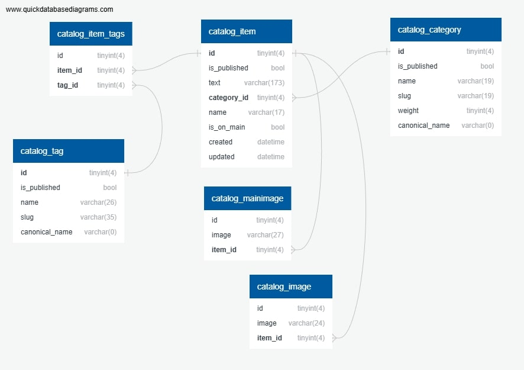

# Lyceum

## Установите и активируйте виртуальное окружение
```bash
python3 -m venv venv
source venv/bin/activate
```
## Клонирование проекта
```bash
git clone git@gitlab.crja72.ru:django/2024/autumn/course/students/248227-bogdansalaeff-course-1187.git Lyceum
cd Lyceum
```
## Включение переводов
```bash
cd lyceum
python3 manage.py compilemessages
```
Необходимо наличие GNU gettext tools 0.15 или выше
## Установка зависимостей
```bash
pip3 install -r requirements/prod.txt
``` 
### Для разработки необходмио дополнительно установить зависмости из 
`requirements/dev.txt`
```bash
pip3 install -r requirements/dev.txt
``` 
### Для запусков тестов зависимости перечислены в `requirements/test.txt`
```bash
pip3 install -r requirements/test.txt
``` 
## Настройка переменных окружения
Скопируйте файл `config.env` в `.env`, если нужно, отредактируйте значения 
переменных.
```bash
cp config.env .env
```
### Дополнительно необходимо выполнить мигрции базы данных
```bash
cd lyceum
python3 manage.py migrate
```
Также для тестов желательно создать фикстуры
```bash
cd lyceum
python3 -Xutf8 manage.py dumpdata --indent 2 --exclude contenttypes > fixtures/data.json
```
## Запуск
```bash
cd lyceum
python3 manage.py runserver
```
## Запуск тестов
```bash
cd lyceum
python3 manage.py test
```
# Структура базы данных приложения catalog
